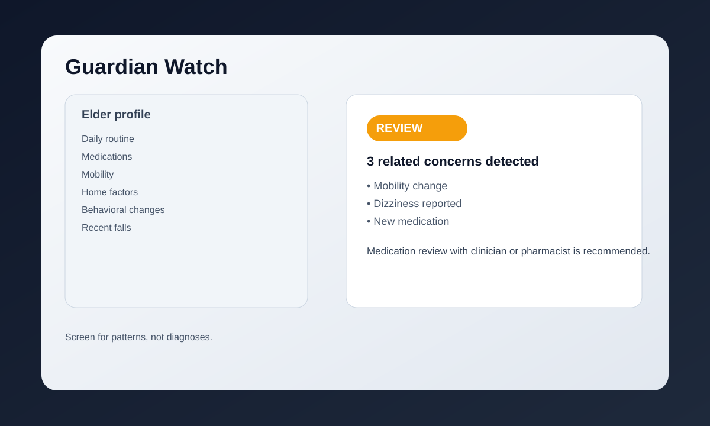

# Guardian Watch

Guardian Watch is a lightweight elder-care risk screener that helps family members identify patterns around falls, medication changes, and routine shifts without diagnosing a medical condition.

## Features

- Safety gate for emergency indicators
- Fall-risk screening
- Medication concern screening
- Change detection across routine and behavior
- Cross-check of related risk signals
- Explainable escalation guidance
- Structured evidence trail

## Demo preview



## Run locally

```bash
python -m pip install -r requirements.txt
streamlit run guardian_watch/ui/streamlit_app.py
```

You can also launch with the included Windows wrapper:

```bat
run_app.bat
```

## Safety boundary

This tool is intended for early screening and escalation support only. It does not diagnose medical conditions or recommend making medication changes without professional review.

## License

This project is licensed under the MIT License. See [LICENSE](LICENSE).

## Contributing

See [CONTRIBUTING.md](CONTRIBUTING.md).

## Security

See [SECURITY.md](SECURITY.md).
